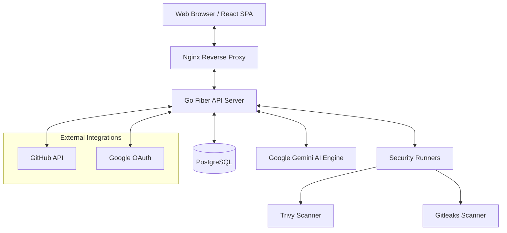

# AI DevSecOps Platform 🛡️🤖

AI DevSecOps Platform is a comprehensive security tool designed to automate vulnerability scanning, secret detection, and AI-driven security analysis for modern software development. It integrates industry-standard security scanners with Google's Gemini AI to provide actionable insights and automated fix suggestions.

## 🏗️ System Design & Architecture

The platform follows a modern client-server architecture, containerized for easy deployment and scalability.

### Architecture Overview



### Core Components

1.  **Frontend (UI/UX)**: A high-performance SPA built with **React 19** and **Vite**, featuring a premium "Glassmorphism" design system. It provides a real-time dashboard for scan results and repository management.
2.  **Backend (API Server)**: A robust RESTful API built with **Go Fiber**, handling authentication, orchestration of scan jobs, and communication with the AI engine.
3.  **Scanner Runner**: An extensible orchestration layer that executes:
    *   **Trivy**: Scans for package vulnerabilities, misconfigurations, and OS-level issues.
    *   **Gitleaks**: Scans repository history for hardcoded secrets, keys, and credentials.
4.  **AI Analysis Engine**: Utilizes **Google Gemini AI** to process complex scan findings, providing:
    *   Detailed explanations of security risks.
    *   Automated fix commands and code snippets.
    *   Prioritization based on context.
5.  **Database**: **PostgreSQL** stores user profiles, scan history, and detailed security findings for long-term tracking.

## 🚀 Tech Stack

- **Backend**: [Go](https://go.dev/) (Fiber), Gorm (PostgreSQL)
- **Frontend**: [React](https://react.dev/) (Vite), TypeScript, Lucide Icons, Custom CSS
- **Security**: [Trivy](https://aquasecurity.github.io/trivy/), [Gitleaks](https://github.com/gitleaks/gitleaks)
- **AI**: [Google Gemini Pro API](https://ai.google.dev/)
- **Infrastructure**: Docker, Nginx, Terraform (AWS EKS)

## 🛠️ Getting Started

### Prerequisites

- Docker and Docker Compose
- Google Gemini API Key
- GitHub/Google OAuth Credentials

### Local Development

1. Clone the repository:
   ```bash
   git clone https://github.com/Arthit3108/AI-DevSecOps-Platform.git
   cd AI-DevSecOps-Platform
   ```

2. Configure environment variables in `.env`:
   ```env
   POSTGRES_USER=admin
   POSTGRES_PASSWORD=password
   POSTGRES_DB=devsecops
   GEMINI_API_KEY=your_key_here
   GITHUB_CLIENT_ID=your_id
   GITHUB_CLIENT_SECRET=your_secret
   ```

3. Spin up the platform using Docker Compose:
   ```bash
   docker-compose up --build
   ```

4. Access the dashboard:
   - Frontend: `http://localhost` (via Nginx)
   - API Docs: `http://localhost:8080`

## 📊 Security Scanning Workflow

1.  **Repository Analysis**: The user selects a repository for scanning.
2.  **Tool Orchestration**: The backend triggers concurrent scans using Trivy and Gitleaks.
3.  **Finding Aggregation**: Results are normalized and unified into a single report.
4.  **AI Augmentation**: Vulnerabilities are sent to Gemini AI for deep analysis.
5.  **Reporting**: Users receive a detailed report with severity rankings and AI-suggested fixes.

---
*Created with ❤️ for more secure software development.*
